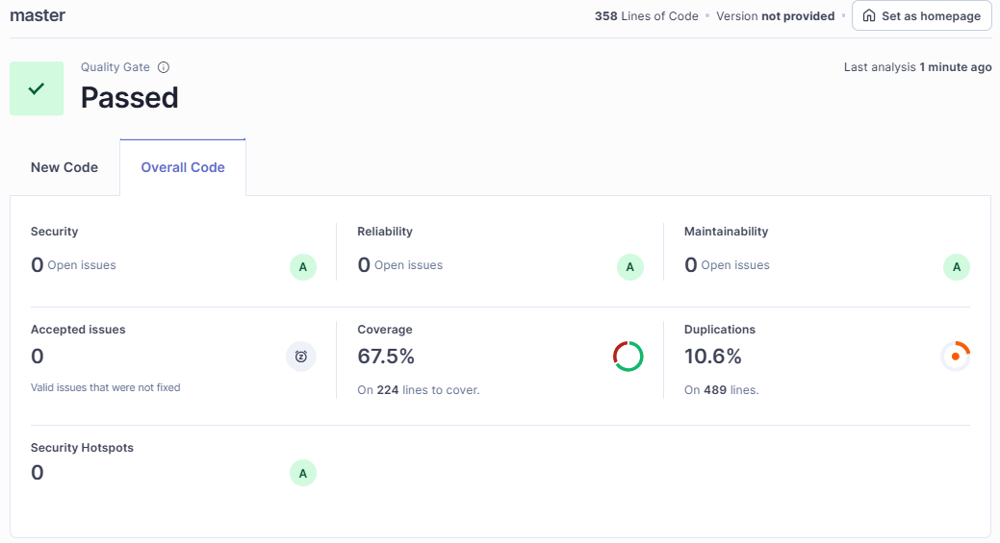

# Client Management API - Challenge Intuit / Yappa

Este repositorio contiene una API REST desarrollada en **.NET 8** para la gestión de clientes. El proyecto fue realizado como parte del desafío técnico para Intuit / Yappa.

## 📝 Nota sobre el Idioma
> **Aclaración Importante:** Aunque este documento (README) está redactado en español para facilitar la evaluación, **todo el código fuente, los comentarios, los logs y los mensajes de respuesta de la API se han desarrollado en inglés**.
>
> Esta decisión se tomó para mantener estándares de desarrollo internacionales y facilitar la retro-compatibilidad con mi desarrollo anterior.

---

## 🚀 Tecnologías Utilizadas

### Backend
* **Framework:** .NET 8 (C#)
* **ORM:** Entity Framework Core 9.0
* **Base de Datos:** PostgreSQL 18
* **Driver:** Npgsql
* **Documentación:** OpenAPI / Swagger
* **Testing:** xUnit + Moq
* **Patrones:** Repository Pattern, DTOs, Global Exception Handling

### Frontend
* **Framework:** Angular 21
* **Arquitectura:** Standalone Components (sin NgModules)
* **UI Library:** Angular Material 21
* **Testing:** Vitest
* **Estilos:** CSS

### Calidad & CI
* **Análisis Estático:** SonarQube
* **Cobertura:** 67% (Backend)

---

## ✨ Funcionalidades

### Backend (API)
1.  **CRUD Completo:**
    * Creación (POST) con validación de unicidad para CUIT y Email.
    * Lectura (GET) individual por ID y listado completo.
    * Actualización (PUT) con validación de consistencia de datos.
    * Eliminación (DELETE).
2.  **Búsqueda Avanzada (Stored Procedure):**
    * Implementación de búsqueda por nombre utilizando una **Función SQL Nativa** (search_clients).
    * Soporte para búsquedas *case-insensitive* y *accent-insensitive* (ignora tildes) mediante la extensión `unaccent` de PostgreSQL.
3.  **Validaciones de Negocio:**
    * Formato de CUIT (Regex: XX-XXXXXXXX-X).
    * Formato de Email y Celular (10 dígitos).
    * Manejo centralizado de excepciones (GlobalExceptionHandler).

### Frontend (App)
1.  **Dashboard de Clientes:** Tabla interactiva con ordenamiento y paginación.
2.  **Búsqueda en Tiempo Real:** Filtro por nombre desde el cliente.
3.  **Formularios Reactivos:**
    * Validaciones visuales inmediatas.
    * Manejo de errores en inputs (Email inválido, campos requeridos).
4.  **UX/UI:**
    * Uso de Modales (MatDialog) para Crear/Editar.
    * Animaciones de expansión para ver detalles completos del cliente ("Razón Social", "Fecha Nacimiento").

---

## 🛡️ Calidad de Código y SonarQube

El proyecto ha sido auditado utilizando **SonarQube** para garantizar la ausencia de *Code Smells*, vulnerabilidades de seguridad y asegurar una cobertura de pruebas superior al estándar requerido.

### Reporte de Análisis

---

## 🛠️ Configuración y Ejecución

### 1. Prerrequisitos
* .NET 8 SDK
* Node.js (v20+) y NPM
* Servidor PostgreSQL local

### 2. Configuración de Base de Datos
El sistema requiere una base de datos PostgreSQL llamada `intuit_challenge`.

1.  Accede a tu cliente SQL favorito (pgAdmin, DBeaver).
2.  Ejecuta el script **backend/scripts/schema.sql**. Esto realizará lo siguiente:
    * Habilitará la extensión `unaccent`.
    * Creará la tabla `clientes`.
    * Insertará datos de prueba (Seed data).
3.  Ejecuta el script **backend/scripts/search_clients.sql** para crear la función almacenada de búsqueda.

### 3. Configuración del Backend

> **Nota de Seguridad:** Para cumplir con las reglas de SonarQube y las buenas prácticas, el archivo `appsettings.json` del repositorio **no contiene** la contraseña de la base de datos (evitando *Hardcoded Secrets*).

Para facilitar la ejecución local del challenge, puedes utilizar la siguiente configuración de prueba.

**Opción A: Configuración Rápida (Modificar appsettings.json)**
Copia y pega esta cadena de conexión en backend/ClientApi/appsettings.json:

"ConnectionStrings": {
  "DefaultConnection": "Host=localhost;Database=intuit_challenge;Username=postgres;Password=dummy_password"
}

*(Asegúrate de reemplazar dummy_password y postgres con tus credenciales locales reales).*

**Opción B: User Secrets (Recomendado / Clean Code)**
Si prefieres no tocar el archivo JSON (para no commitear credenciales accidentalmente), ejecuta en la terminal dentro de backend/ClientApi:

dotnet user-secrets set "ConnectionStrings:DefaultConnection" "Host=localhost;Database=intuit_challenge;Username=postgres;Password=TU_PASSWORD_REAL"

### 4. Ejecución

#### Levantar Backend

cd backend/ClientApi
dotnet run

La API estará disponible en: https://localhost:7131

#### Levantar Frontend

cd frontend
npm install
npm start

La aplicación estará disponible en: http://localhost:4200

---

## 📚 Documentación de API

Una vez que el backend esté en ejecución, puedes acceder a la documentación interactiva (Swagger) para probar los endpoints directamente:

👉 **https://localhost:7131/swagger/index.html**

---

## 🧪 Testing

### Backend (xUnit)
Se han implementado pruebas unitarias para Controladores y Repositorios, utilizando Moq para aislar dependencias y InMemoryDatabase para tests de integración de repositorios.

cd backend
dotnet test

### Frontend (Vitest)
El frontend utiliza **Vitest** para una ejecución de pruebas unitarias rápida y moderna.

cd frontend
npm test

### Para generar reporte de cobertura (LCOV) para SonarQube:
npm run test -- --coverage

---

## 🧠 Decisiones de Diseño

1.  **PostgreSQL & Unaccent:** Se eligió Postgres sobre MySQL para aprovechar la función `unaccent`
2.  **Repository Pattern:** Se implementó para desacoplar la lógica de negocio (Controller) del acceso a datos (EF Core).
3.  **DTOs vs Entidades:** Se utiliza `CreateClientDto` para la entrada de datos, separando el contrato de la API del modelo de base de datos y evitando problemas de *Over-Posting*.